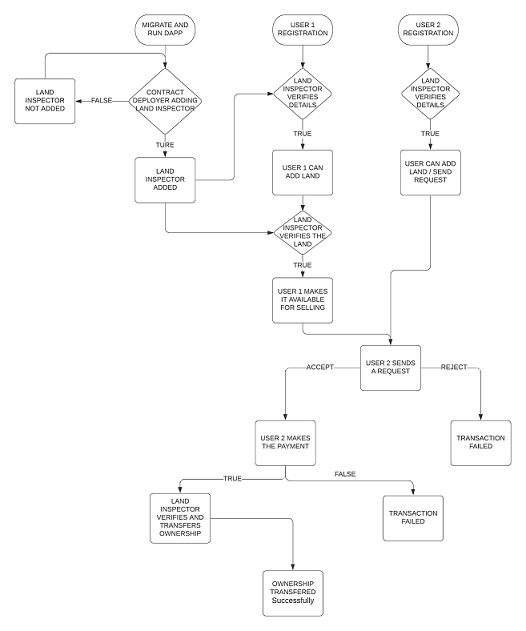
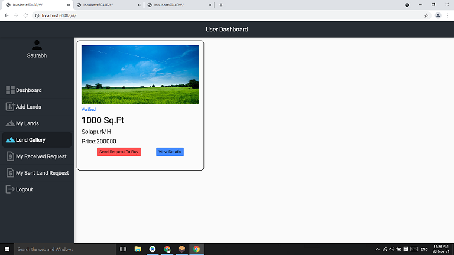
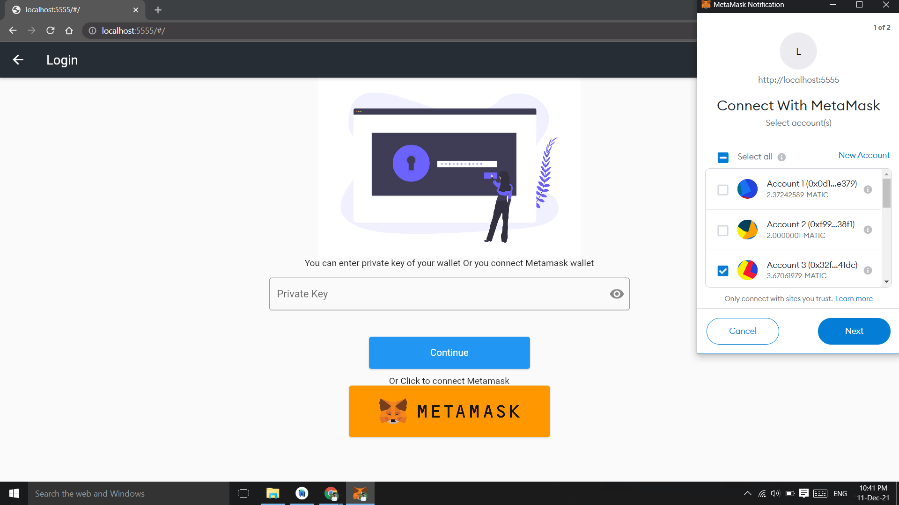

# Blockchain-Based-Property-Registration

<a href="LICENSE"></a>


## Land Registration using Blockchain
## Problem it Solves:
1.) Removal of middlemen.\
Removal of middlemen or brokers makes the process less expensive. Brokers trying to cheat uneducated
people will no longer be able to do so. Brokers often take a long time to complete the procedures and so
our project will also save people time.\
2.) Distributed tamper proof ledger which prevents any fraud in ownership.\
3.) Secure storage of sensitive property registration documents using IPFS.

## Technology Stack:
1. Ethereum Blockchain
2. Polygon/Matic
3. Web3Dart
4. IPFS
5. Flutter
6. Metamask

## Run Application Locally
1.Clone the github repository and cd to the folder\
2.Install flutter,nodejs\
3.Install ganache and truffle
```
npm install -g truffle
```
4.Open Ganache and keep it running in the Background
5.Install Metamask chrome extension,choose local network and import accounts
6.Compile and run our migrations from the command line like this
```
truffle compile
truffle migrate
```
6.Copy contract address paste in ./lib/providers/MetamaskProvider.dart - 'contractAddress' and Change operatingChain to '1337'\
7.Copy contract address paste in  ./lib/providers/LandRegisterModel.dart - 'contractAddress' and change '_rpcUrl' to "http://127.0.0.1:7545" \
8.Run flutter web app
```
flutter run -d web-server --web-port 5555
```
9.Open the browser and the dapp will be running in http://localhost:5555/

## Project Flowchart


## Screenshots
  | 

  | 

  | 


